# Graph layout in rust

This crate provides trait definitions and implementation that help to layout and render graphs.

# Features

- support for [petgraph](https://github.com/petgraph/petgraph) graphs (via the `petgraph` feature flag)
- basic layout engine (Fruchterman Reingold approach)
- basic static or animated svg rendering (via `svg` feature flat)

# Example renderings

More examples can be found [here](./examples)

## Tetrahedron

## Triangulated Triangle

## Tree

## Prism

